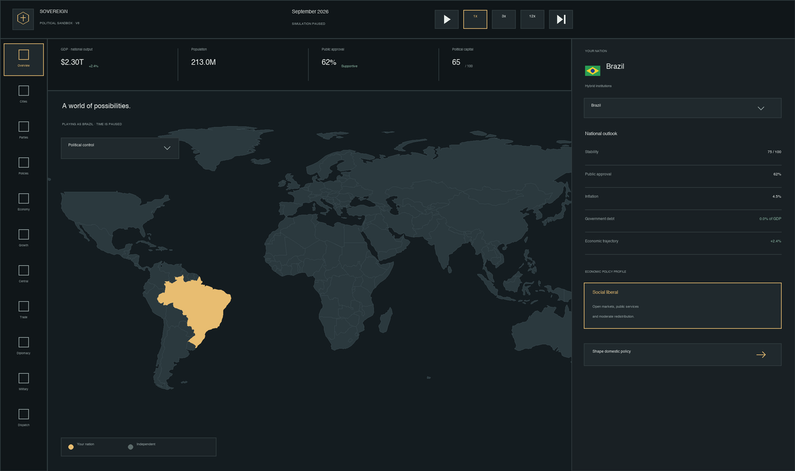

<div align="center">

# Sovereign — Political Sandbox

**A geopolitical strategy game that runs entirely in one HTML file.**

[**▶ Play**](https://thenicedoctor.github.io/) · [Economic model](docs/economic-model.md) · [Architecture](docs/architecture.md) · [Modelling limits](docs/modelling-limits.md) · [Changelog](CHANGELOG.md)




</div>

## What it is

Lead any of **204 countries** through fiscal policy, monetary policy, city management, trade,
parties and diplomacy, simulated month by month. There is no victory condition — it is a sandbox,
and you decide what you are optimising for.

One self-contained HTML file with **no runtime dependencies**: no build step for the player, no
account, no server, no network calls. Save it to disk and it still works.

| | |
|---|---|
| Playable countries | 204 — every UN member, both observer states, nine scenario entities |
| Named cities | 1,198, with local budgets and a crime-pressure index |
| Policy controls | 63, from income-tax brackets to central-bank independence |
| Start eras | 1970, 1985, 2000, 2026 — **with the states of the period** |
| Historical states | Soviet Union, Yugoslavia, Czechoslovakia, Serbia and Montenegro |
| Divided countries | East/West Germany, North/South Vietnam, North/South Yemen |
| Difficulty modes | Easy (no national debt), Medium, Hard |
| File size | ~500 KB, everything embedded |

## The simulation

Output is produced, not granted. Each month the engine solves a small macroeconomic model for
every country:

- **Supply** — a Cobb-Douglas production function, `Y = A · K^0.33 · L^0.67`, with capital
  accumulation net of depreciation and *conditional* convergence: catching up to the frontier
  requires institutions, schooling and openness, so weak states converge slowly or not at all.
- **Demand** — an output gap driven by real rates against a modelled neutral rate, the fiscal
  impulse, competitiveness, trade and shocks. Demand moves output around the supply path; it
  cannot raise it for long.
- **Money** — a Taylor-type reaction function, a central-bank balance sheet and a credibility
  score. Inflation follows an expectations-augmented Phillips curve.
- **Labour** — Okun's law around a structural floor, with participation and population responding
  to pensions, childcare, training and migration.

See [docs/economic-model.md](docs/economic-model.md) for the equations.

## Eras

An era rescales world output and population, shifts prices and policy rates, and sets
period-appropriate trade barriers, capital controls, central-bank independence and exchange-rate
regimes — Bretton Woods pegs in 1970, managed floats in 1985. The productivity frontier the
convergence model chases moves with the era, so catching up in 1970 means catching up to 1970.

The map follows the era too. In 1970 the Soviet Union covers fifteen present-day countries as one
state with Moscow, Leningrad, Sverdlovsk and Alma-Ata among its cities; **Germany, Vietnam and
Yemen are each split in two**, with East Berlin against West Berlin and Hanoi against Saigon;
Bangladesh, the UAE and Zimbabwe do not exist yet; Sri Lanka is Ceylon and Burkina Faso is Upper
Volta.

The divided countries are genuinely cut, not relabelled: `src/build/split-polygons.py` slices the
polygon along a fitted border and fails the build if a piece is too far from the historical land
area.

> **These are textbook relationships and scenario assumptions, simplified for playability.**
> Nothing is estimated from data or calibrated to a real country, no figure the game displays is a
> statistic about a real place, and no border or name is a comment on any territorial dispute.
> See [docs/modelling-limits.md](docs/modelling-limits.md).

## Repository layout

```
src/base/      sovereign-v3.html      the artifact the build chain starts from
src/addons/    v4…v11-addon.js         each version's new behaviour, layered by wrapping functions
src/build/     build-v4…v11.py         exact-string patch scripts, one per version
src/data/      map polygons, city catalogue, provenance notes
tests/         check-game…check-v11.cjs   engine invariants, run in a vm sandbox
dist/          sovereign-v11.html      the built game
docs/          architecture, economic model, modelling limits, CI workflows
index.html     the published landing page  (a user Pages site, served from the root)
play/          the published game
```

## Building

The shipped HTML is **never hand-edited**. Each version is a Python script performing
exact-string replacements against the previous version's output, asserting that every anchor is
found exactly once — so a build either reproduces byte for byte or fails loudly.

```bash
python3 src/build/build-v4.py    # src/base/sovereign-v3.html -> v4
python3 src/build/build-v5.py    # cities, trade, central bank, production function
python3 src/build/build-v6.py    # difficulty modes, optional national debt
python3 src/build/build-v7.py    # eras, dispatches, mobile layout
python3 src/build/build-v8.py    # historical states per era
python3 src/build/build-v9.py    # divided countries
python3 src/build/build-v10.py   # repeatable debt relief
python3 src/build/build-v11.py   # wars fought on the real border  -> dist/
python3 src/build/build-site.py  # assembles the published site at the repository root
```

Why not a bundler: the deliverable is deliberately one file a player can save and open offline.
Patch scripts keep every change reviewable as a diff of intent rather than of minified output.

## Testing

The suites run the real shipped file inside a Node `vm` with a fake DOM, asserting invariants
rather than snapshots — the production-function identity, growth accounting summing to potential
growth, Okun's law, the central bank's reaction function, matched trade flows, that no successor
state coexists with its predecessor, save migration from every earlier version, and a fifty-year
stability run in each difficulty mode and era.

```bash
node tests/check-v11.cjs
for f in tests/check-*.cjs; do node "$f" || exit 1; done
```

All ten suites pass. Ready-to-use GitHub Actions workflows are in
[`docs/ci/`](docs/ci/) — see [docs/ci/README.md](docs/ci/README.md) to enable them.

## Contributing

See [CONTRIBUTING.md](CONTRIBUTING.md). In short: add a new `build-vN.py` and `vN-addon.js` rather
than editing a shipped file or an old script, and make every suite pass.

## Credits and licence

Code is MIT ([LICENSE](LICENSE)). Map outlines from
[Natural Earth](https://www.naturalearthdata.com/) (public domain). Place names spot-checked with
[GeoNames](https://www.geonames.org/) (CC BY 4.0), curated and simplified for gameplay; see
[src/data/city-catalog-v5-notes.md](src/data/city-catalog-v5-notes.md) for sourcing and for the
sovereignty and recognition caveats.
